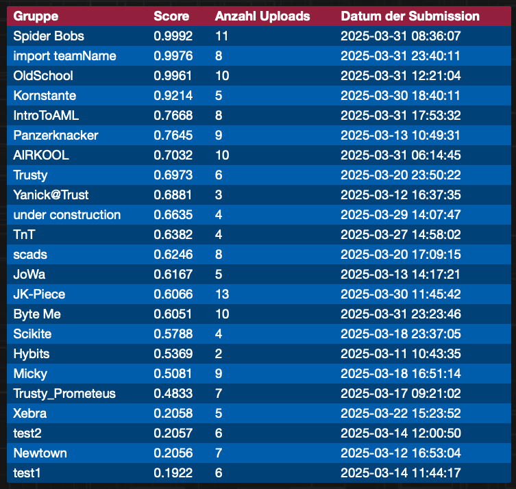

# Bremen Big Data Challenge 2025

The BBDC2025 is a big data / machine learning challenge running every March 1st to 31st and has multiple Tracks. This is my solution (Team OldSchool) and analysis for the professional track: 
https://bbdc.csl.uni-bremen.de/de/2025-2/professional-track/

Table of Contents:
- [Repository Structure](#repository-structure)
- [Solution Reproduction and Core Idea](#solution-reproduction-and-core-idea)
- [Transaction Level / Notes](#transaction-level--notes)
- [Understandings](#understandings)
- [Log](#log)
- [Next Steps](#next-steps)
- [Account Level Classification / Deep Learning](#account-level-classification--deep-learning)
- [Error Analysis](#error-analysis)
- [Simulations](#simulations)
- [Features and Sophisticated Models](#features-and-sophisticated-models)
- [My Submissions](#my-submissions)
- [Final Thoughts](#final-thoughts)

## Repository Structure
- `lvl_account/` contains the code for classification on account level (ie aggregated transactions per account predict if the account is a fraudster or not)
- `lvl_transaction/` contains the code for classification on transaction level (ie predict if a single transaction is fraudulent or not, as the labels are given per account, this is less performant)
- `plots/` contains the data insight plots I generated during the challenge. Generated by running `plot_all.sh` (does take some time).
- `plots_analyze/` contains the plots I generated to analyze the results of my models, i.e. which errors were made and how those error accounts might differ from other accounts.
- `task/` contains the preprocessed versions of the data. Generated by running `preprocess_all.sh`. 
- `task_orig/` should contain the original data. As I am not allowed to publish the data, please download it from the BBDC website and extract it to this folder. The data is not included in the repo.

## Solution Reproduction and Core Idea
**Solution Reproduction Steps:**
1. Download the dataset from the BBDC website and extract it to the task_orig folder so that you have task_orig/train_set/x_train.csv.
2. Install the requirements from requirements.txt: `pip install -r requirements.txt`.
3. Run `bash preprocess_all.sh` (make sure version is set to ver12 in the script).
4. `cd lvl_account/`.
5. Run `python3 evaluate.py --precompute --comp --model_class simple_cnn --batch_size=442 --num_train_epochs=50 --val_every_epoch=1` (you'll need 12GB of GPU memory for this).
6. Set the trained model path in the rec_cnn4.
7. Run `python3 evaluate.py --precompute --comp --model_class rec_cnn4 --batch_size=442 --num_train_epochs=50 --val_every_epoch=1`.

My best submission (`2025.03.31_12.04.44_rec_cnn4_test.csv`) was made that way. The log output should be similar to `2025.03.31_12.04.44_rec_cnn4.txt`. It is only marginally better (three or four samples, iirc) than the simple_cnn, so you could stop at step 5 and have a similarly good result.

The core idea is the following: predict the fraudster label based on the aggregated transactions of that account. Calculate features that also include that account's interactions with other accounts, e.g. by using the SnapML features or tracking the exact same amount of money being moved. The feature extraction is done in `lvl_transaction/model/features/ver12.py`. Afterwards, different models can be trained. Most notably, the simple_cnn already works well if the features are good (ie ver12 > ver05 > ver01). In some cases, the rec_cnn4 can mitigate some smaller issues. It keeps track of the current fraud predictions and inserts them into the feature set, allowing for accounts to be scrutinized differently if one of their neighbours is a fraudster. In practice, the latter seldom improved the results. I think there is a single case in the validation data where the fraudster was sent money, but the month had ended before they could launder it.

Final Standing (we are 3rd, as we got overtaken by import Teamname in the last 20 minutes). Before that it was a tight race with Spider Bobs.

My Teamname choice was on a whim, because I tend to prioritize data analysis and understanding over throwing the biggest model at the problem. I ended up actually doing both but the former was more successful.

## Transaction Level / Notes
- The data is generated  
    -> Can we reverse engineer the data generation process?  
        -> Or: what are the typical features considered for modelling this?  
        -> Additionally: there must be some variable, even if it is withheld, that informs if a transaction is fraudulent or not – what would I use if I were to generate such a dataset?
    -> Is this based on real world distributions or did they make them up themselves? If the latter, on what basis? Is there open research to consider?
- 15% fraudsters -> any model that we can use thresholding with should have an according threshold  
    -> Potentially the organizers used different percentages for train/val/test.
- There are examples of this kind of task:
    - https://www.kaggle.com/datasets/ealaxi/paysim1 → looks very similar from a data standpoint → I would assume the BBDC also used https://changefinancial.com/paysim/ to generate the data.
       -> There are also example models – we should try those first:
            -> https://www.kaggle.com/code/salmarashwan/building-a-fraud-detection-model-paysim-case-study has really good results with a RF. Double-check cross_validation and features used.
- Consider model options:
    - Transaction → fraud and then aggregation (current pipeline).
    - Aggregated transactions per account → fraud.
- Consider using autosklearn or autopytorch, since the data is tabular.
- The documentation suggests there are no payments from merchants to customers (i.e. refunds) → a quick search in the transactions also suggests, but does not confirm this.
- New aggregation method idea: use predict_proba of model, select a subset of transactions (not sure if sorted by highest or similar, or just pad) and then use another model to predict if the account is fraudulent or not → not really better than the current method.

### Understandings
- The fraudulent percentage differs between the datasets (train is mostly between 10-15% per action, val ranges from 3-15% per action, test is obviously unclear).
- The aggregation per AccountID is based on quantiles atm → the model before should be tuned for fraud precision over recall as faulty transaction labeling is more costly than missing a fraudulent transaction (specifically as not all transactions of a fraudulent account are necessarily fraudulent).
    -> Tuning for precision can achieve 100% fraud transaction precision, but recall is low, resulting in bad fraudster f1 → tuning is not worth it atm.
    -> Adjusted CV split for less aggressive optimization and adjusted aggregation method → results are on par without precision tuning; might consider revisiting in final models, but not atm.
- Ver01 feature set is better (over raw) in RF and BRF: roughly doubles fraud precision (transaction) and is ~8 points better in macro f1, 20 in fraud f1 (account).
- Ver02 feature set is better (over v1):
    - BRF: 
        - Transaction: 2x fraud precision, 1.5x recall (ironically f1 almost identical).
        - Account: +20 points fraud f1, +10 points macro f1.
    - RF: 
        - Transaction: fraud: 1.5x precision, 4x recall, 4x f1.
        - Account: fraud f1: -3 points, macro identical (weirdly only 8% got selected → because only one of their transactions got flagged and a lower threshold isn't possible).
    => Next: either consider a better selection/aggregation method or try autopytorch or the simulation.
- RF with 1000 trees instead of 100 is better in transactional (+1 f1, +4pre and +1rec), but ironically not worse (-1) in account f1.

### Log
- Read description and added some thoughts.
- Plotted data.
- Setup pipeline and implemented dummy, RF and BRF models.
- Submitted two submissions with RF on train.csv and RF on train+val+kaggle.
- Added features (mostly from the diss/chatgpt: transactional, some behavioural, some social → could be more, no agent based).
- Re‑ran models with v01 features → pretty good results (see above).
- Added precision‑optimized RF → results are not better but have higher risk.
- Realized that the fraudster percentage is more like 13% (at least in train and val) → did lead to worse results; probably tune at the end (as f1 is the harmonic mean between precision and recall).
- Added features v02.
- Re‑ran models with v02 features → results are pretty good / on par (see above).
- Investigated aggregation strategies: while interesting, the main source of error remains uncertainty in the transactional model.
- Uploaded an unchecked submission with RF on train+val+kaggle → results were not good, as the model predicted 100% fraud for some reason, but gave the idea to reverse engineer the fraud/non‑fraud ratio. Would need to submit a version with no fraud though → missed that I could have already calculated it here. In the test set we have a precision of 0.114 if all are labeled fraudster → so we have 11.4% fraudsters in the test set, more precisely 1,267 out of 11,057 accounts.

### Next Steps
- Submit a version with no fraud to reverse engineer the fraudster percentage.
- Consider features → stacking, embedding?
- Consider a CNN model for transactional data, though unsure how to train on basically only one sample or how to split the data into multiple samples instead of a single big one → could enable cross‑referencing/calc transactions making the feature space less crucial.
- Double-check if Kaggle data is useful or harmful → train on train+kaggle and validate on val.

## Account Level Classification / Deep Learning
- Added new SSL and fraud classification methods. Core idea: incorporate network info into each transaction, then group the transactions per account and classify directly if those are fraudulent or not → should scale well (i.e. not per transaction but also not per dataset). However, it is key that we find all of the network info, because it is not in the transactions of a single account.
- Realized that fraudsters do seldom only use cash (2-7 out of 11k accounts) and that we might be able to aggregate the cash transactions to condense our data.
- Question: does the simulation consider the order of transactions relevant? → Likely not, as it is agent‑based with a certain probability to perform such actions → we could aggregate transactions. If we assume only topological fraud (i.e. circle, fan‑in/out, etc.) we could even aggregate per account pair. If we assume single transactions as fraudulent, aggregation must be done carefully → from what I gather the core idea in amlsim (and paysim) is to only flag certain actions during simulation that are creating one of the known topologies.
- Placative, but might help in shifting perspective: we are given the vertices of a graph that is constructed by the properties of the nodes. We then want to get back to the properties, more specifically the fraudster property.
- Also: consider the other direction – which accounts are we sure are normal?
    - Accounts only using cash_in or cash_out (see plot).
    - Anything else?
- Note on data version in comparison to the simple CNN:
    - ver: fraud f1 -- tensorboard log version  
      ver05: 0.92 -- 10  
      ver01: 0.79 -- 11  
      ver03: 0.91 -- 12  
      ver02: 0.76 -- 13  
      ver04: 0.92 -- 14  
      --- (some further changes, most notably higher hidden_dim and potential for more epochs → basically converge faster, but top out at the same value) ---  
      ver06: 0.91 -- 30  
      ver07: 0.91 -- 31  
      --- (some more changes) ---  
      attn tensor versions of interest: 11 and 22  
      --- (some more changes) ---  
      version, fraud f1, tensorboard log, model  
      ver05: 0.94 -- 33 (simple_cnn)  
      ver11: 0.91 -- 34 (simple_cnn)  
      ver11: 0.91 -- 19 (rec_cnn)  
      ver05(input): 0.67 -- 37 (simple_cnn, mx 4048)  
      ver05(input): 0.70 -- 38 (simple_cnn, mx 2024)  
      ver05(input): 0.79 -- 40 (simple_cnn, min 2024)  
      ver05(input): 0.73 -- 23 (attn_cnn, min 2024)  
    - Note: Highest count is probably not the best metric for the inputer, but in the case of the 69 non‑recoverable fraud cases they only got input from other fraudsters, so this should still work quite well → actually then maybe the smallest is even better, as it messes the least with the previous model.

### Error Analysis
Transactions of C2934430280

| Hour |    Action |     Amount |    AccountID | External |  OldBalance |  NewBalance |  isUnauthorizedOverdraft | External_Type | 
| ---- | --------- | ---------- | ------------ | -------- | ----------- | ----------- | ------------------------ | ------------- |
|   19 |   CASH_IN |  178180.26 |  C2934430280 |     None |       21.28 |   178201.54 |                        0 |          None | 
|   41 |   CASH_IN |  205387.30 |  C2934430280 |     None |   178201.54 |   383588.84 |                        0 |          None | 
|   44 |   CASH_IN |  129218.21 |  C2934430280 |     None |   383588.84 |   512807.05 |                        0 |          None | 
|   47 |   CASH_IN |  156677.13 |  C2934430280 |     None |   512807.05 |   669484.19 |                        0 |          None | 
|  139 |   CASH_IN |   73271.37 |  C2934430280 |     None |   669484.19 |   742755.56 |                        0 |          None | 
|  203 |  CASH_OUT |   66520.96 |  C2934430280 |     None |   809276.52 |   742755.56 |                        0 |          None | 
|  214 |   CASH_IN |  243380.04 |  C2934430280 |     None |   742755.56 |   986135.59 |                        0 |          None | 

It appears some transactions are missing in the data. i.e. I cannot come up with another explanation of why the NewBalance is the same after an action that does not have zero amounts.  
This happens for non‑fraud accounts as well → I assume the organizers removed random transactions to make the task harder.

Given the plot `plots_analyze/non_rescuable_errors_heatmap.pdf` it appears we lack the information to detect around 60 fraud accounts. This could be because each model compensates slightly differently when misclassifying non‑fraudsters, so figure out what unifies these 60 accounts and try to feature engineer that.  
→ It appears all of these do not operate in a network with other fraudster customers.  
→ Given the `reverse_neighbor_graph_subplots.pdf` I finally could confirm that the main issue is that some fraud accounts are mainly fraud because they receive money from other fraud accounts. This is something we currently do not represent. I've tried with the rec_cnn but could not get it to work. Will re‑consider this approach now.  
→ Ah, this also explains the "missing" transactions. Those are simply transactions to this account that are not listed here, as they are not from this account.

→ Tested a bunch and all the variations on including neighboring accounts did not improve results.  
New hunch: in all error cases the fraudulent behaviour seems to specifically be that the accounts, once receiving a sum, cash out later to the penny. I would have expected the model to pick up on that eventually, but I might have abstracted too much. Will try to add one or two features based on this.

mmh, seems I misunderstood the single training misclassification / did not model that correctly in the feature extraction. But tbh even if I could still beat the SpiderBobs, I'm happy they are likely taking first. They have been the runner‑up for some time now and it would not feel right :D So I'm not going to spend more time or fix the last wrong classifications. I'll clean everything up tomorrow and call it a day for now. It was a great challenge. Thanks to the organizers and the other participants!

## Simulations
- https://bth.diva-portal.org/smash/get/diva2:955852/FULLTEXT06.pdf  
- https://github.com/IBM/AMLSim  
- https://springernature.figshare.com/articles/dataset/synthetic_transactions/22396057?backTo=%2Fcollections%2FSynthAML_a_Synthetic_Data_Set_to_Benchmark_Anti-Money_Laundering_Methods%2F6504421&file=39841711

## Features and Sophisticated Models
- https://snapml.readthedocs.io/en/v1.15/graph_preprocessor.html  
    - https://dl.acm.org/doi/pdf/10.1145/3677052.3698674  
    - https://github.com/IBM/snapml-examples/blob/main/examples/graph_feature_preprocessor/graph_feature_preprocessor.ipynb  
- https://github.com/IBM/Multi-GNN  
    -> python main.py --data Small_HI --model pna --emlps

## My Submissions
| file                                            | online score        | w. avg f1  | f1 fraud   | changelog |
| ----------------------------------------------- | --------------------| ---------- | ---------- | --------- |
| 2025.03.03_14:44:20_models.rf_test.csv          | 0.4389078498293515  | 0.85       | 0.47       | Simple RF trained on training set |
| 2025.03.03_14:58:23_models.rf.txt               | 0.44907723855092274 |            |            | Simple RF trained on train+val+kaggle |
| 2025.03.04_10.22.19_models.rf_test.csv          | 0.20561506004543978 | 0.81       | 0.67       | Simple RF on ver01. retrained on train+val+kaggle → predicted only fraudsters -> calc fraud number in test |
| 2025.03.04_10.22.19_models.rf_test.csv modified | 0.0                 | -          | -          | Contains only non‑fraudsters for percentage calculation reasons |
| 2025.03.21_15.38.02_simple_cnn_test.txt         | 0.9318555008210181  | 0.96       | 0.93       | Simple CNN trained on ver05 train set |
| 2025.03.21_16.22.16_simple_cnn_test.csv         | 0.9338809034907597  | -          | 0.935 (TS) | As abover but on 80:20 of train+val. Performance is not better and classification report is skewed → include tensorboard fraud |
| 2025.03.24_13.04.48_attn_cnn2_test.csv          | 0.9330677290836653  | 0.96       | 0.94       | Attn CNN trained on ver05. First model with balanced precision and recall for fraudsters. |
| 2025.03.26_12.24.12_attn_cnn_test.csv           | 0.9517241379310344  | 0.97       | 0.95       | Attn CNN trained on ver08 (tensorboard attn_cnn/version_26) |
| 2025.03.31_12.04.44_rec_cnn4_test.csv           | 0.9960629921259844  | 1.0        | 1.0        | Rec CNN utilizing simple_cnn (ver51) trained on ver12 with the GNF features only for transaction |

## Final Thoughts
Total hours spent on the challenge: 95h / 2.5 weeks. In this time I implemented and evaluated:
- Transaction level detection with multiple simple models.
- Inclusion and later exclusion of Kaggle dataset.
- Plotting of accounts.
- Feature engineering: per transaction, per account and across accounts.
- Research on other standards in AML.
- Self‑supervised learning and BERT fine tuning.
- Account level detection with multiple deep learning models.
- Error analysis.
- Iteration on features and models.

Overall, I'm very happy with the result and the learnings I took from this. I approached this with an iterative process spanning modeling, research, and implementation. I was positively surprised by GitHub Copilot, especially for some scripts and plotting. Yes, there was quite some re‑writing, but the more specific my descriptions (i.e. “x axis shows this, y axis that”) the better the results. Most performance was achieved when I manually optimized functions, but Copilot offered good enough suggestions in most cases. I'm a little stung to have been overtaken in the last hour, but such is a challenge. I'm also glad I didn't see it earlier, as I might have changed my mind about cheesing the last few misclassifications by reverse engineering the uploads. Overall, after 5 years of organizing, I am happy to have been able to participate and learn so much.
